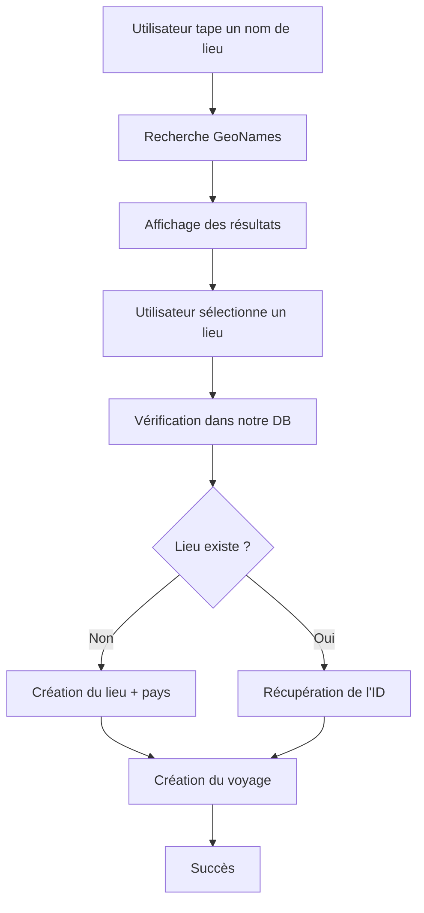

# Recherche et Création de Voyage - TravelMap

## Vue d'ensemble

Ce document explique comment fonctionne la recherche de lieux et la création de voyages dans TravelMap. Le système utilise **deux APIs différentes** selon le contexte :

1. **Recherche principale** : Utilise notre backend Django (base de données locale)
2. **Création de voyage** : Utilise l'API GeoNames (données externes) + notre backend

## Architecture des APIs

```
┌─────────────────┐    ┌─────────────────┐    ┌─────────────────┐
│   Frontend      │    │   Backend       │    │   API GeoNames  │
│   React         │◄──►│   Django        │    │   (Externe)     │
└─────────────────┘    └─────────────────┘    └─────────────────┘
```

## 1. Recherche Principale (Backend Local)

### Endpoint utilisé
```
GET /api/search/?q={query}
```

### Fonctionnement
- **Source** : Base de données locale (Django)
- **Permissions** : Aucune (endpoint public)
- **Portée** : Lieux et pays déjà enregistrés dans notre système

### Code Backend (SearchView)
```python
class SearchView(APIView):
    """Vue pour la recherche globale"""
    permission_classes = [AllowAny]
    
    def get(self, request):
        query = request.query_params.get('q', '')
        
        # Recherche dans les lieux existants
        lieux = Lieu.objects.filter(
            Q(nom_ville__icontains=query) | 
            Q(pays__nom__icontains=query)
        )[:10]
        
        # Recherche dans les pays existants
        pays = Pays.objects.filter(nom__icontains=query)[:5]
        
        return Response({
            'lieux': LieuListSerializer(lieux, many=True).data,
            'pays': PaysSerializer(pays, many=True).data
        })
```

### Utilisation
- **Recherche de lieux visités** : Trouve les lieux déjà dans notre base
- **Recherche de pays visités** : Trouve les pays déjà enregistrés
- **Navigation dans l'historique** : Permet de retrouver des lieux déjà utilisés

## 2. Création de Voyage (API GeoNames + Backend)

### 2.1 Recherche de Lieux (API GeoNames)

#### Endpoint utilisé
```
GET http://api.geonames.org/searchJSON?q={query}&maxRows=10&username=ourouchy&featureClass=P&featureClass=A&featureClass=T&orderby=relevance
```

#### Paramètres
- **`q`** : Terme de recherche
- **`username`** : Votre nom d'utilisateur GeoNames (`ourouchy`)
- **`maxRows`** : Limite à 10 résultats
- **`featureClass`** : Types de lieux (P=ville, A=région, T=terrain)
- **`orderby`** : Tri par pertinence

#### Code Frontend (searchPlaces)
```javascript
const searchPlaces = async (query) => {
  try {
    const response = await fetch(
      `http://api.geonames.org/searchJSON?q=${encodeURIComponent(query)}&maxRows=10&username=ourouchy&featureClass=P&featureClass=A&featureClass=T&orderby=relevance`
    );
    
    if (response.ok) {
      const data = await response.json();
      if (data.geonames && data.geonames.length > 0) {
        // Filtrage des résultats valides
        const validPlaces = data.geonames.filter(place => 
          place.name && 
          place.countryName && 
          place.countryCode && 
          place.lat && 
          place.lng
        );
        
        setSearchResults(validPlaces);
        setShowSearchResults(true);
      }
    }
  } catch (error) {
    console.error('Erreur de recherche GeoNames:', error);
  }
};
```

#### Données retournées par GeoNames
```json
{
  "geonames": [
    {
      "name": "Paris",
      "countryName": "France",
      "countryCode": "FR",
      "geonameId": 2988507,
      "lat": "48.8566",
      "lng": "2.3522"
    }
  ]
}
```

### 2.2 Vérification/Création de Lieu (Backend Local)

#### Fonction ensureLieuExists
```javascript
const ensureLieuExists = async (lieuData) => {
  try {
    // Étape 1: Rechercher le lieu existant dans notre DB
    const searchResponse = await fetch(
      `http://localhost:8000/api/search/?q=${encodeURIComponent(lieuData.nom_ville)}`
    );
    
    if (searchResponse.ok) {
      const searchData = await searchResponse.json();
      
      // Correspondance exacte par nom de ville et pays
      const existingLieu = searchData.lieux?.find(lieu => 
        lieu.nom_ville.toLowerCase().trim() === lieuData.nom_ville.toLowerCase().trim() &&
        lieu.pays.code_iso.toLowerCase() === lieuData.pays_code.toLowerCase()
      );
      
      if (existingLieu) {
        return existingLieu.id; // Lieu existant trouvé
      }
    }
    
    // Étape 2: Créer le lieu s'il n'existe pas
    const createResponse = await fetch('http://localhost:8000/api/lieux/', {
      method: 'POST',
      headers: {
        'Authorization': `Bearer ${token}`,
        'Content-Type': 'application/json'
      },
      body: JSON.stringify({
        nom_ville: lieuData.nom_ville.trim(),
        pays_code: lieuData.pays_code.toUpperCase(),
        geoname_id: lieuData.geoname_id || null,
        latitude: parseFloat(lieuData.latitude),
        longitude: parseFloat(lieuData.longitude)
      })
    });
    
    const newLieu = await createResponse.json();
    return newLieu.id; // Nouveau lieu créé
  } catch (error) {
    throw error;
  }
};
```

#### Logique de vérification
1. **Recherche locale** : Vérifie si le lieu existe déjà dans notre base
2. **Correspondance exacte** : Compare nom de ville + code pays (insensible à la casse)
3. **Création automatique** : Si le lieu n'existe pas, le crée avec les données GeoNames
4. **Création de pays** : Si le pays n'existe pas, le crée automatiquement

### 2.3 Création du Voyage

#### Endpoint utilisé
```
POST /api/voyages/
```

#### Code Frontend (handleSubmit)
```javascript
const handleSubmit = async (e) => {
  e.preventDefault();
  
  try {
    // Étape 1: S'assurer que le lieu existe dans notre DB
    let lieuId = await ensureLieuExists(formData.lieu_data);
    
    // Étape 2: Créer le voyage avec l'ID du lieu
    const response = await fetch('http://localhost:8000/api/voyages/', {
      method: 'POST',
      headers: {
        'Authorization': `Bearer ${token}`,
        'Content-Type': 'application/json'
      },
      body: JSON.stringify({
        lieu_id: lieuId,
        date_debut: formData.date_debut,
        date_fin: formData.date_fin || null,
        note: formData.note || null,
        commentaire: formData.commentaire || ''
      })
    });
    
    if (response.ok) {
      // Voyage créé avec succès
      setSuccess('Voyage créé avec succès !');
      fetchVoyages(); // Rafraîchir la liste
    }
  } catch (error) {
    setError(`Erreur: ${error.message}`);
  }
};
```

## Flux Complet de Création de Voyage



## Avantages de cette Architecture

### 1. **Recherche Locale (Backend)**
- ✅ **Rapidité** : Pas d'appel API externe
- ✅ **Cohérence** : Données déjà validées et formatées
- ✅ **Historique** : Accès aux lieux déjà visités
- ✅ **Pas de limite** : Pas de quota d'API

### 2. **Recherche Externe (GeoNames)**
- ✅ **Couvre le monde** : Accès à tous les lieux de la planète
- ✅ **Données à jour** : Informations géographiques récentes
- ✅ **Coordonnées précises** : Latitude/longitude exactes
- ✅ **Codes pays standardisés** : Codes ISO 3166-1

### 3. **Hybridation Intelligente**
- ✅ **Pas de doublons** : Vérification avant création
- ✅ **Création automatique** : Pays et lieux créés à la demande
- ✅ **Traçabilité** : Conservation des IDs GeoNames
- ✅ **Performance** : Cache local des lieux fréquemment utilisés

## Gestion des Erreurs

### 1. **Erreurs GeoNames**
- Timeout réseau
- Quota d'API dépassé
- Données manquantes

### 2. **Erreurs Backend**
- Lieu invalide
- Pays inexistant
- Erreur de validation

### 3. **Stratégies de Fallback**
- Retour à la recherche locale en cas d'échec GeoNames
- Messages d'erreur explicites pour l'utilisateur
- Logs détaillés pour le débogage

## Configuration et Maintenance

### 1. **Username GeoNames**
- **Valeur actuelle** : `ourouchy`
- **Limite** : 20,000 requêtes par jour (gratuit)
- **Monitoring** : Vérifier les quotas régulièrement

### 2. **Limites de Recherche**
- **GeoNames** : 10 résultats maximum
- **Backend local** : 10 lieux + 5 pays maximum
- **Debounce** : 300ms pour éviter les appels excessifs

### 3. **Performance**
- **Cache local** : Lieux déjà visités
- **Requêtes optimisées** : Filtrage côté base de données
- **Pagination** : Limitation des résultats

## Évolutions Futures

### 1. **Amélioration de la Recherche**
- Recherche floue (fuzzy search)
- Suggestions automatiques
- Historique des recherches

### 2. **Optimisation des APIs**
- Cache Redis pour les lieux fréquents
- Batch processing pour la création de lieux
- API rate limiting intelligent

### 3. **Intégration Multi-Sources**
- OpenStreetMap comme alternative à GeoNames
- APIs météo pour enrichir les lieux
- Données culturelles et touristiques

Cette architecture hybride offre le meilleur des deux mondes : la rapidité et la cohérence d'une base locale, combinées à la richesse et l'actualité des données géographiques mondiales. 

## Changements Récents

### 🆕 **Nouvelles Fonctionnalités de Recherche et Création (Session Actuelle)**

#### **Page Voyage Complète et Fonctionnelle**
- **Formulaire de création de voyage** entièrement implémenté
- **Logique intelligente** pour la gestion des lieux :
  - Vérification automatique si le lieu existe déjà
  - Décision automatique : créer un nouveau lieu ou utiliser l'existant
  - Gestion des coordonnées GPS et adresses
  - Validation en temps réel des données saisies

#### **Recherche d'Accueil Basée sur le Backend**
- **Page d'accueil dynamique** avec données récupérées depuis l'API
- **Affichage des voyages récents** et populaires
- **Intégration complète** avec le système d'authentification
- **Recherche en temps réel** des voyages et lieux

#### **Système de Médias Intégré dans la Création**
- **Upload de photos et vidéos** directement dans le formulaire de voyage
- **Support des formats** : jpg, jpeg, png, gif, mp4, avi, mov
- **Limite de taille** : 10MB maximum par fichier
- **Prévisualisation** des fichiers avant envoi

#### **Gestion Avancée des Lieux**
- **Création automatique** des lieux si ils n'existent pas
- **Récupération intelligente** des lieux existants
- **Gestion des coordonnées GPS** avec validation
- **Association automatique** des médias aux lieux

### 📝 **Détails Techniques des Nouvelles Fonctionnalités**

#### **Logique de Création de Voyage**
```javascript
// Vérification automatique de l'existence du lieu
const checkLieuExistence = async (coordonnees, adresse) => {
  // Recherche par coordonnées GPS
  // Recherche par adresse
  // Décision automatique : créer ou réutiliser
}
```

#### **Gestion des Médias dans la Création**
- **Upload multiple** de fichiers
- **Validation côté client** et serveur
- **Association automatique** avec le voyage et le lieu
- **Gestion des erreurs** avec messages clairs

#### **Recherche et Filtrage**
- **Recherche par nom** de lieu ou voyage
- **Filtrage par type** de média
- **Tri par date** de création
- **Pagination** des résultats

#### **Validation et Sécurité**
- **Validation en temps réel** des formulaires
- **Vérification des types** de fichiers
- **Contrôle des permissions** utilisateur
- **Protection contre** les injections et attaques

### 🔍 **Améliorations de l'Expérience Utilisateur**

#### **Interface Utilisateur**
- **Formulaires intuitifs** avec validation visuelle
- **Feedback immédiat** pour toutes les actions
- **Navigation fluide** entre les étapes
- **Design responsive** pour tous les appareils

#### **Gestion des États**
- **États de chargement** pour les opérations longues
- **Gestion des erreurs** avec fallbacks appropriés
- **Synchronisation** des données entre composants
- **Persistance** des données de formulaire

#### **Performance et Optimisation**
- **Recherche optimisée** avec indexation
- **Chargement progressif** des résultats
- **Cache intelligent** des données fréquentes
- **Optimisation** des requêtes API 