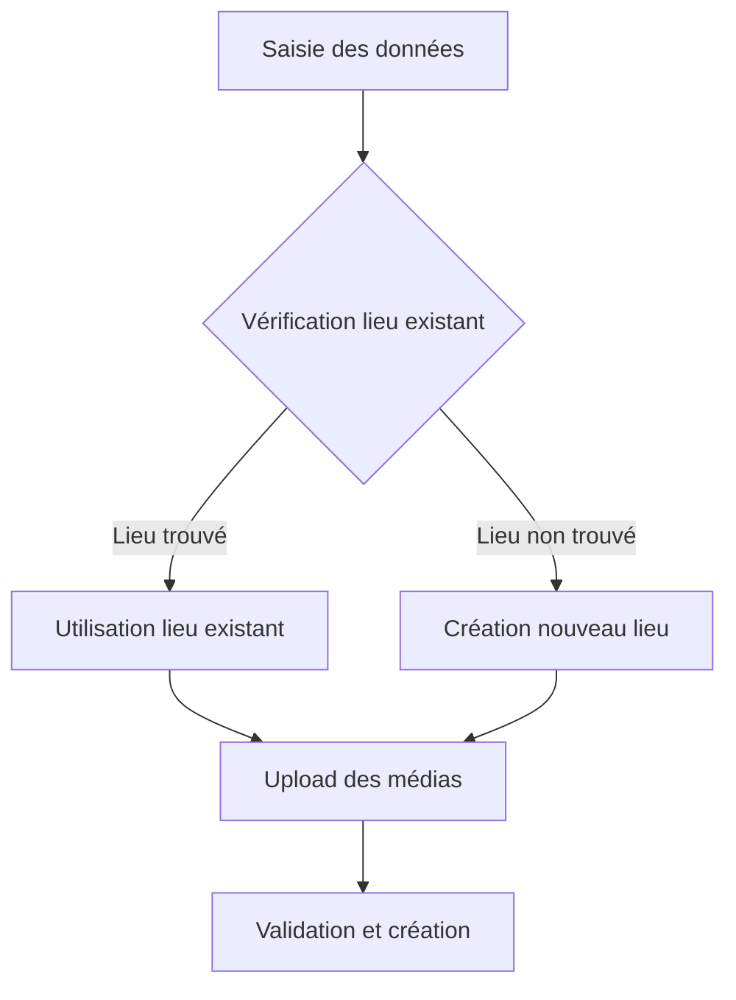

# Flow Utilisateur - TravelMap Backend

## Vue d'ensemble

Ce document explique **ce qui est implémenté côté backend** et **ce qui reste à développer** pour TravelMap. Le backend est partiellement fonctionnel, avec les fonctionnalités de base implémentées.

## **Authentification - IMPLÉMENTÉ**

### Ce qui marche
- **Inscription** : POST `/api/auth/register/`
- **Connexion** : POST `/api/auth/login/`
- **JWT Tokens** : Access + Refresh tokens
- **Déconnexion** : Suppression côté client

### Ce que le frontend peut faire
- Créer des comptes utilisateurs
- Connecter les utilisateurs
- Gérer les tokens JWT
- Vérifier l'authentification

## **Gestion des Lieux - IMPLÉMENTÉ **

### Ce qui marche
- **Liste des lieux** : GET `/api/lieux/`
- **Détails d'un lieu** : GET `/api/lieux/{id}/`
- **Recherche de lieux** : GET `/api/lieux/search/?q=paris`
- **Recherche globale** : GET `/api/search/?q=paris`
- **Détails personnalisés** : GET `/api/lieux/{lieu_id}/detail/` (avec infos utilisateur)

### Ce que le frontend peut faire
- Afficher tous les lieux
- Rechercher des lieux
- Voir les détails d'un lieu
- Voir si l'utilisateur a visité/favorisé un lieu

## **Gestion des Favoris - IMPLÉMENTÉ **

### Ce qui marche
- **Liste des favoris** : GET `/api/favoris/` (utilisateur connecté)
- **Ajouter un favori** : POST `/api/favoris/`
- **Supprimer un favori** : DELETE `/api/favoris/{id}/`
- **Pas de doublons** : Un lieu ne peut être favori qu'une fois

### Ce que le frontend peut faire
- Afficher les favoris de l'utilisateur
- Ajouter/supprimer des favoris
- Voir si un lieu est en favori

## **Gestion des Voyages - IMPLÉMENTÉ **

### Ce qui marche
- **Liste des voyages** : GET `/api/voyages/` (utilisateur connecté)
- **Créer un voyage** : POST `/api/voyages/`
- **Modifier un voyage** : PUT `/api/voyages/{id}/`
- **Supprimer un voyage** : DELETE `/api/voyages/{id}/`
- **Validation** : Dates, notes (1-5), commentaires

### Ce que le frontend peut faire
- Afficher l'historique des voyages
- Créer de nouveaux voyages
- Modifier des voyages existants
- Supprimer des voyages

## **Statistiques Utilisateur - IMPLÉMENTÉ **

### Ce qui marche
- **Profil utilisateur** : GET `/api/profile/`
- **Statistiques** : Lieux visités, pays visités, score total, nombre de voyages/favoris

### Ce que le frontend peut faire
- Afficher le dashboard utilisateur
- Montrer les statistiques de voyage
- Calculer des métriques

## **Profil Public des Autres Utilisateurs - IMPLÉMENTÉ (NOUVEAU)**

### Ce qui marche
- **Profil public** : GET `/api/users/{user_id}/profile/`
- **Données publiques** : Nom, prénom, bio, photo de profil, score, statistiques
- **Statistiques** : Nombre de voyages, activités créées, pays visités
- **Accès public** : Aucune authentification requise

### Ce que le frontend peut faire
- Afficher le profil d'autres utilisateurs
- Créer des liens cliquables vers les profils
- Montrer les statistiques publiques des autres utilisateurs
- Naviguer entre les profils utilisateurs

## **Gestion des Pays - IMPLÉMENTÉ **

### Ce qui marche
- **Liste des pays** : GET `/api/pays/`
- **Recherche de pays** : GET `/api/pays/search/?q=france`
- **Codes ISO** : Identifiants uniques pour les pays

### Ce que le frontend peut faire
- Afficher la liste des pays
- Filtrer par pays
- Rechercher des pays

---

## **FONCTIONNALITÉS MANQUANTES - À IMPLÉMENTER **

## **Gestion des Activités - NON IMPLÉMENTÉ**

### Ce qui manque
- **Modèle Activité** : Titre, description, lieu, créateur
- **CRUD Activités** : Créer, lire, modifier, supprimer
- **Notes d'activités** : Système de notation des activités
- **Endpoints** :
  - `POST /activites` – Créer une activité
  - `GET /activites/{id}` – Voir une activité + notes
  - `POST /activites/{id}/note` – Noter une activité

### Impact sur le frontend
- Impossible de créer/consulter des activités
- Pas de système de notation d'activités
- Fonctionnalité "contribuer" non disponible

## **Système de Quizz - NON IMPLÉMENTÉ**

### Ce qui manque
- **Modèle Quizz** : Titre, lieu, créateur, questions
- **Modèle Question** : Question, réponse correcte, choix multiples
- **Modèle Résultat** : Score utilisateur, date achèvement
- **Endpoints** :
  - `POST /quizz` – Créer un quizz
  - `GET /quizz/{id}` – Voir un quizz
  - `POST /quizz/{id}/reponse` – Répondre à un quizz

### Impact sur le frontend
- Pas de système de quiz pour gagner des points
- Fonctionnalité "apprendre" non disponible
- Pas de gamification

## **Système de Score - NON IMPLÉMENTÉ**

### Ce qui manque
- **Modèle Score** : Score total par utilisateur
- **Calcul automatique** : Points pour voyages, activités, quiz
- **Endpoints** :
  - `GET /score` – Voir son score
  - `POST /score/update` – Mettre à jour le score

### Impact sur le frontend
- Pas de système de points/gamification
- Pas de classement ou de progression
- Fonctionnalité "compétition" non disponible

## **Gestion des Médias - NON IMPLÉMENTÉ**

### Ce qui manque
- **Modèle Media** : Photos/vidéos liées aux voyages
- **Upload de fichiers** : Gestion des médias
- **Endpoints** :
  - `POST /media` – Uploader un média
  - `GET /media/{id}` – Voir un média
  - `DELETE /media/{id}` – Supprimer un média

### Impact sur le frontend
- Pas de photos/vidéos dans les voyages
- Fonctionnalité "souvenirs visuels" non disponible

## **API GeoNames - NON INTÉGRÉE**

### Ce qui manque
- **Auto-complétion** : Suggestions de lieux en temps réel
- **Intégration API** : Connexion avec GeoNames
- **Endpoints** :
  - `GET /geonames/search?q=query` – Recherche GeoNames

### Impact sur le frontend
- Pas d'auto-complétion dans la recherche
- Expérience utilisateur moins fluide

---

## **Fonctionnalités Techniques - PARTIELLEMENT IMPLÉMENTÉES**

### Base de données
- **Modèles de base** :  Pays, Lieu, Voyage, Favori, User
- **Modèles manquants** :  Activité, Quizz, Question, Résultat, Score, Media
- **Relations** :  Relations de base définies
- **Validation** :  Contraintes et validation des données de base

### API REST
- **ViewSets de base** :  CRUD pour les modèles implémentés
- **ViewSets manquants** :  Activités, Quizz, Media
- **Permissions** :  Authentification requise pour les données privées
- **Sérialisation** :  Conversion JSON bidirectionnelle pour les modèles existants

### Sécurité
- **JWT** :  Authentification stateless
- **Permissions** :  Chaque utilisateur ne voit que ses données
- **Validation** :  Protection contre les données invalides

---

## **Ce que le Frontend peut construire MAINTENANT**

### Pages principales (fonctionnelles)
1. **Page d'accueil** : Recherche et découverte 
2. **Page de connexion/inscription** : Authentification 
3. **Page des lieux** : Liste et recherche 
4. **Page détail lieu** : Informations de base 
5. **Page profil** : Statistiques de base 
6. **Page voyages** : Historique et création 
7. **Page favoris** : Gestion des favoris 

### Fonctionnalités utilisateur (disponibles)
- **Recherche** : Barre de recherche de base 
- **Navigation** : Parcourir les lieux et pays 
- **Gestion de compte** : Inscription, connexion, déconnexion 
- **Voyages** : CRUD complet des voyages 
- **Favoris** : Ajouter/supprimer des favoris 
- **Statistiques de base** : Dashboard personnel 

### Fonctionnalités utilisateur (manquantes)
- **Activités** : Créer/consulter des activités 
- **Quizz** : Système de quiz et apprentissage 
- **Score** : Système de points et gamification 
- **Médias** : Photos/vidéos dans les voyages 
- **Auto-complétion** : Suggestions de lieux 

---

## **Workflow de développement Frontend**

### Phase 1 : Fonctionnalités de base 
1. Créer les formulaires de connexion/inscription
2. Gérer les tokens JWT
3. Protéger les routes privées
4. Page d'accueil avec recherche basique
5. Liste et détails des lieux
6. Gestion des voyages et favoris

### Phase 2 : Fonctionnalités avancées 
1. Système d'activités (quand implémenté)
2. Système de quiz (quand implémenté)
3. Upload de médias (quand implémenté)
4. Auto-complétion (quand intégrée)

### Phase 3 : Amélioration UX
1. Interface utilisateur
2. Animations et transitions
3. Responsive design
4. Carte interactive (LeafletJS)

---

## **Endpoints Disponibles**

### Authentification 
- `POST /api/auth/register/`
- `POST /api/auth/login/`
- `GET /api/ping/`

### Lieux 
- `GET /api/lieux/` (ViewSet - liste)
- `GET /api/lieux/{id}/` (ViewSet - détail standard)
- `GET /api/lieux/search/?q=query` (ViewSet - action)
- `GET /api/lieux/{lieu_id}/detail/` (Vue personnalisée - détail enrichi)
- `GET /api/lieux/{id}/voyages/` (ViewSet - action)

### Voyages (authentifié) 
- `GET /api/voyages/`
- `POST /api/voyages/`
- `PUT /api/voyages/{id}/`
- `DELETE /api/voyages/{id}/`

### Favoris (authentifié) 
- `GET /api/favoris/`
- `POST /api/favoris/`
- `DELETE /api/favoris/{id}/`

### Pays 
- `GET /api/pays/`
- `GET /api/pays/search/?q=query`

### Recherche 
- `GET /api/search/?q=query`

### Profil (authentifié) 
- `GET /api/profile/`

### Endpoints manquants 
- **Activités** : `POST /api/activites/`, `GET /api/activites/{id}/`, etc.
- **Quizz** : `POST /api/quizz/`, `GET /api/quizz/{id}/`, etc.
- **Médias** : `POST /api/media/`, `GET /api/media/{id}/`, etc.
- **Score** : `GET /api/score/`
- **GeoNames** : `GET /api/geonames/search/`

### Nouveaux Endpoints Implémentés (Session Actuelle)
- **Profil public** : `GET /api/users/{user_id}/profile/` - Profil public des autres utilisateurs

---

## **État Actuel**

### Backend - PARTIELLEMENT FONCTIONNEL
- ✅ Modèles de base (Pays, Lieu, Voyage, Favori, User)
- ✅ API REST pour les fonctionnalités de base
- ✅ Authentification JWT
- ✅ Validation des données de base
- ✅ Permissions et sécurité de base
- ✅ Profil public des autres utilisateurs (NOUVEAU)
- ⚠️ Lieux : Lecture seule (pas de création/modification via API)
- ❌ Modèles avancés (Activité, Quizz, Media, Score)
- ❌ API REST pour fonctionnalités avancées
- ❌ Intégration API externe (GeoNames)

### Frontend - À DÉVELOPPER
- ❌ Interface utilisateur
- ❌ Composants React
- ❌ Gestion d'état
- ❌ Navigation
- ❌ Design et UX

---

## **Prochaines Étapes**

### Backend (priorité)
1. **Implémenter les modèles manquants** : Activité, Quizz, Question, Résultat, Score, Media
2. **Créer les ViewSets et sérialiseurs** pour les nouveaux modèles
3. **Intégrer l'API GeoNames** pour l'auto-complétion
4. **Implémenter le système de score** automatique
5. **Gérer l'upload de fichiers** pour les médias

### Frontend
1. **Démarrer le frontend** : React + Vite
2. **Implémenter les fonctionnalités de base** : Authentification, lieux, voyages, favoris
3. **Attendre l'implémentation backend** pour les fonctionnalités avancées
4. **Intégrer la carte interactive** : LeafletJS + OpenStreetMap
5. **Design et UX** : Interface utilisateur

**Le backend a les fonctionnalités de base, il manque les fonctionnalités avancées (activités, quiz, médias, score) !** 🚀

## Changements Récents

### 🆕 **Nouveaux Flux Utilisateur et Améliorations (Session Actuelle)**

#### **Flux de Création de Voyage Complet**
- **Étape 1** : Saisie des informations de base du voyage
- **Étape 2** : Gestion intelligente des lieux :
  - Saisie des coordonnées GPS ou adresse
  - Vérification automatique de l'existence du lieu
  - Décision automatique : créer un nouveau lieu ou utiliser l'existant
- **Étape 3** : Upload des médias (photos/vidéos)
- **Étape 4** : Validation et création du voyage

#### **Flux d'Accueil Dynamique**
- **Connexion utilisateur** avec authentification
- **Récupération automatique** des données depuis le backend
- **Affichage des voyages récents** et populaires
- **Navigation directe** vers les voyages existants
- **Accès rapide** au formulaire de création

#### **Flux de Visualisation des Lieux avec Cartes**
- **Affichage automatique** de la carte Leaflet dans chaque lieu
- **Positionnement précis** des marqueurs selon les coordonnées GPS
- **Navigation fluide** entre les lieux d'un voyage
- **Interface responsive** adaptée à tous les appareils

#### **Flux de Gestion des Médias**
- **Upload de fichiers** avec validation en temps réel
- **Prévisualisation** des médias avant envoi
- **Association automatique** avec les voyages et lieux
- **Gestion des erreurs** avec messages clairs

### 📝 **Détails des Nouveaux Flux**

#### **Processus de Création Intelligente**

#### **Gestion Automatique des Lieux**
- **Recherche par coordonnées GPS** (précision 6 décimales)
- **Recherche par adresse** avec géocodage
- **Détection des doublons** avec seuil de tolérance
- **Création automatique** si aucun lieu similaire trouvé

#### **Intégration Cartographique**
- **Chargement automatique** des cartes dans chaque lieu
- **Centrage automatique** sur les coordonnées du lieu
- **Marqueurs interactifs** avec informations du lieu
- **Navigation fluide** entre les différents lieux

### 🔄 **Améliorations de l'Expérience Utilisateur**

#### **Navigation Simplifiée**
- **Transitions fluides** entre les composants
- **Breadcrumbs** pour la navigation
- **Retour rapide** aux pages précédentes
- **URLs propres** pour chaque section

#### **Gestion des États**
- **États de chargement** pour toutes les opérations
- **Feedback immédiat** pour les actions utilisateur
- **Gestion des erreurs** avec fallbacks appropriés
- **Persistance** des données de formulaire

#### **Responsive Design**
- **Adaptation automatique** à tous les écrans
- **Navigation tactile** pour les appareils mobiles
- **Optimisation** pour les petits écrans
- **Accessibilité** améliorée

### 🚀 **Nouvelles Fonctionnalités Utilisateur**

#### **Recherche Avancée**
- **Recherche en temps réel** des voyages et lieux
- **Filtrage par type** de média
- **Tri par différents critères** (date, popularité, distance)
- **Suggestions automatiques** pendant la saisie

#### **Gestion des Préférences**
- **Sauvegarde** des préférences utilisateur
- **Personnalisation** de l'interface
- **Historique** des actions récentes
- **Favoris** pour les voyages et lieux

#### **Notifications et Alertes**
- **Confirmation** des actions importantes
- **Alertes** pour les erreurs et succès
- **Notifications** pour les mises à jour
- **Feedback visuel** pour toutes les interactions

### 🎯 **Flux des Activités - Nouveau Parcours Utilisateur (NOUVEAU)**

#### **Flux de Création d'Activité**
1. **Accès à la page Activités** : Clic sur "Activités" dans la navbar
2. **Sélection de destination** : Clic sur une destination visitée
3. **Formulaire de création** : Modal avec destination pré-remplie (read-only)
4. **Saisie des informations** : Titre et description de l'activité
5. **Validation et création** : Vérification des permissions et sauvegarde

#### **Flux de Gestion des Activités**
1. **Consultation de ses activités** : Section "Mes Activités Créées"
2. **Modification d'activité** : Clic sur "Modifier" → Modal de modification
3. **Suppression d'activité** : Clic sur "Supprimer" → Confirmation
4. **Synchronisation** : Rechargement automatique de la liste

#### **Flux d'Affichage des Activités dans les Lieux**
1. **Navigation vers un lieu** : Via recherche depuis l'accueil
2. **Consultation des activités** : Section "Activités disponibles" sous les voyages
3. **Informations affichées** : Titre, description, créateur, notes moyennes
4. **Préparation à la notation** : Bouton "Noter cette activité" (prêt pour implémentation)

#### **Logique Métier Implémentée**
- **Permissions automatiques** : Seuls les lieux visités permettent la création d'activités
- **Validation en temps réel** : Vérification des droits avant chaque action
- **Interface cohérente** : Même style et comportement que les voyages existants
- **Gestion d'erreurs** : Messages clairs et fallbacks appropriés